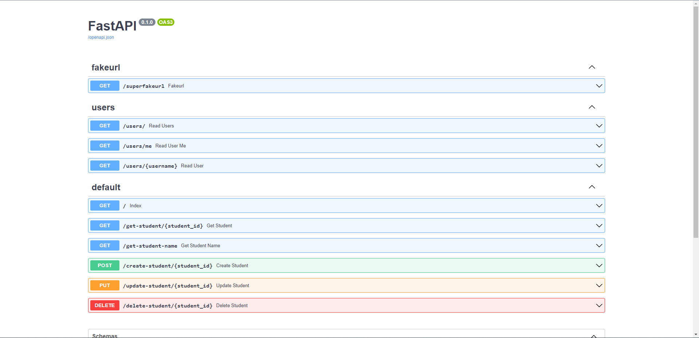

# Fastapi headstart with Docker


## Requirements
1. Docker
2. Install python dependencies using 
    ```bash  
        pip install -r requirements.txt 
    ```
3. To start fastapi-webapp run
    ```bash  
        uvicorn main:app --reload 
    ```
4. To start fastapi-webapp with docker run
    ```bash  
    1. (Run only once) docker build -t fastapi_headstart .
    2. docker run -d --name mycontainer -p 80:80 fastapi_headstart
    ```


## Routing

<br>
<br>
For more information on routing visit <a href="https://fastapi.tiangolo.com/tutorial/bigger-applications/">fastapi documentation</a>

Visit http://127.0.0.1:8000/docs to view the api docs generated by fastapi


## Deployment
For more information on deployment visit <a href="https://fastapi.tiangolo.com/deployment/docker/">fastapi documentation</a>

