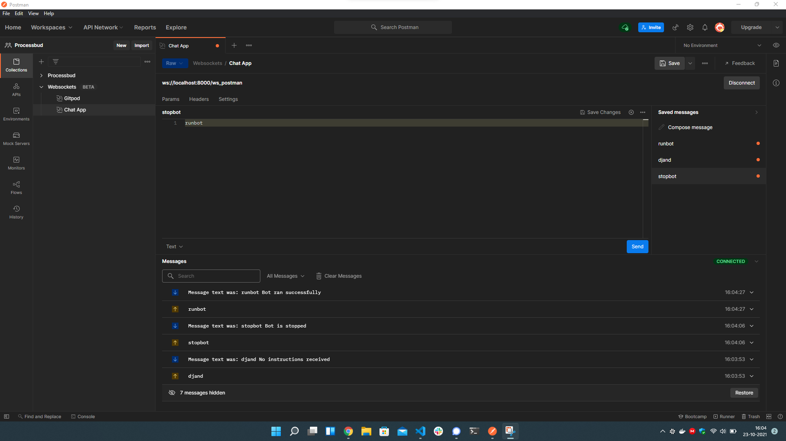

# Fastapi headstart with Docker


## Requirements
1. Docker
2. Install python dependencies using 
    ```bash  
        pip install -r requirements.txt 
    ```
3. To start fastapi-webapp run
    ```bash  
        uvicorn main:app --reload 
    ```
4. To start fastapi-webapp with docker run
    ```bash  
    1. (Run only once) docker build -t fastapi_headstart .
    2. docker run -d --name mycontainer -p 80:80 fastapi_headstart
    ```
5. Rename <u>alembic.ini.example</u> file to <u>alembic.ini</u> and update the <i><u>sqlalchemy.ur</u>l</i> (Line 54) variable with your values.
6. Rename <u>app/settings.config.example</u> file to <u>app/settings.config</u> and update with your postgres credentials.


## Routing

<br>
<br>
For more information on routing visit <a href="https://fastapi.tiangolo.com/tutorial/bigger-applications/">fastapi documentation</a>

Visit http://127.0.0.1:8000/docs to view the api docs generated by fastapi

## Websockets



## DB
1. Postgres
    ```
    1. docker pull postgres
    2. docker run --name some-postgres -e POSTGRES_PASSWORD=mysecretpassword -d postgres
    3. Create database // inside docker 
        3.1    psql -U postgres
        3.2    CREATE DATABASE mydb;
    ```
2. Couchbase
## Deployment
For more information on deployment visit <a href="https://fastapi.tiangolo.com/deployment/docker/">fastapi documentation</a>

